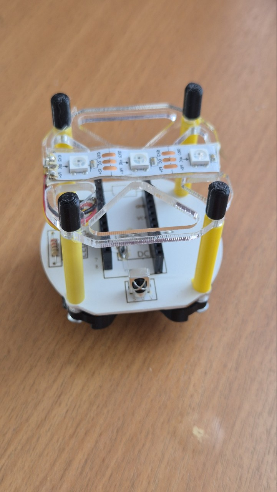

# 3D-printed lamp

Небольшая настольная лампа с корпусом и абажуром, изготовленными на 3D-принтере. Волнистая полупрозрачная поверхность мягко рассеивает свет, а закрученная форма делает лампу выразительным предметом интерьера даже в выключенном состоянии.

Лампу можно собрать в двух вариантах: с обычной светодиодной лампочкой или со светодиодной лентой. Во втором случае лента подключается к плате управления, для которой внутри предусмотрены гребёнки, а инфракрасный датчик позволяет принимать команды дистанционно.

  
  
  

  

